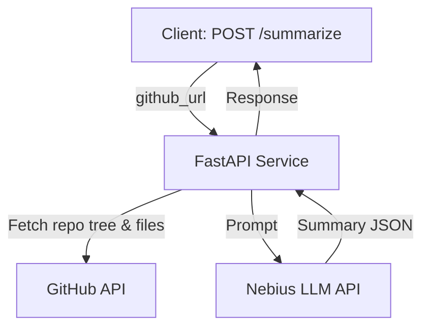

# AI GitHub Repo Summariser — Nebius Academy Admission Assignment

**Requires Python 3.10+**

## Overview
This API service takes a GitHub repository URL and returns a human-readable summary of the project: what it does, what technologies are used, and how it's structured. It uses FastAPI and the Nebius Token Factory LLM API.

---

## Architecture Diagram



---

## Setup Instructions

1. **Clone the repo and enter the directory:**
	 ```bash
	 git clone <your-repo-url>
	 cd ai-github-repo-summariser
	 ```

2. **Create and activate a virtual environment:**
	 ```bash
	 python3 -m venv venv
	 source venv/bin/activate
	 ```

3. **Install dependencies:**
	 ```bash
	 pip install -r requirements.txt
	 ```


4. **Set your Nebius API key:**
	- **Option 1:** Create a `.env` file:
	  ```env
	  NEBIUS_API_KEY=your_nebius_api_key_here
	  ```
	- **Option 2:** Set environment variable directly:
	  ```bash
	  export NEBIUS_API_KEY=your_key   # macOS/Linux
	  set NEBIUS_API_KEY=your_key      # Windows
	  ```

5. **Start the server:**
	```bash
	./venv/bin/uvicorn main:app --reload
	```

6. **Check health:**
	```bash
	curl http://localhost:8000/health
	# {"status": "ok"}
	```
---

## Key Professional Improvements

- Fails fast if Nebius API key is missing
- Uses GitHub repo's default branch for tree fetch
- Cleans LLM JSON output before parsing
- Adds timeouts to all requests
- Handles GitHub rate limits
- Prompt is deterministic for JSON output
- Smarter `.py` file selection (prefers `src/`, root, repo-named folders)

---

## Usage

Send a POST request to `/summarize` with a JSON body:

```json
{
	"github_url": "https://github.com/psf/requests"
}
```

Example using `curl`:
```bash
curl -X POST http://localhost:8000/summarize \
	-H "Content-Type: application/json" \
	-d '{"github_url": "https://github.com/psf/requests"}'
```

### Response (200 OK)
```json
{
	"summary": "Requests is a popular Python library for making HTTP requests...",
	"technologies": ["Python", "urllib3", "certifi"],
	"structure": "The project follows a standard Python package layout..."
}
```

### Error Response (e.g. 404)
```json
{
	"status": "error",
	"message": "Repository not found"
}
```

---

## OpenAPI & Professional API Design

- **OpenAPI docs**: [http://localhost:8000/docs](http://localhost:8000/docs)
- **Response models**: All responses use Pydantic models for clarity and contract.
- **Error handling**: All errors return a structured JSON with status and message, and proper HTTP codes.
- **Health endpoint**: `/health` for production readiness.
- **Operation summaries**: Each endpoint has a clear summary for documentation.

---

## Model Choice

This solution uses the `openchat/openchat-3.5-0106` model from Nebius Token Factory for its balance of cost, speed, and output structure. You can change the model in `main.py` if desired.

---

## Repository Processing Strategy

- **Included:**
	- All README files
	- Key config files (`requirements.txt`, `pyproject.toml`, etc.)
	- Up to 5 main `.py` source files
	- Directory tree (first 100 files)
- **Skipped:**
	- Binary files (images, videos, archives, etc.)
	- Large dependency folders (`venv/`, `node_modules/`, etc.)
	- Build and cache folders
- **Context limit:**
	- Total extracted text is limited to ~8k characters, prioritizing README and config files.
- **Why:**
	- This approach gives the LLM the most relevant context (project description, structure, and main code) while staying within context limits and avoiding noise.

---

## Prompt Engineering

The LLM prompt explicitly requests:

```
Respond in JSON with keys: summary, technologies (list), structure.
```

---


## Notes
- The Nebius API key is loaded from `.env` or environment and never hardcoded.
- `.env`, `venv/`, and other unnecessary files are excluded via `.gitignore`.
- Error handling is robust for invalid URLs, missing repos, LLM/API failures, and GitHub rate limits.

---

## Submission Checklist
- [x] Working source code for the API service
- [x] requirements.txt with all dependencies
- [x] README.md with setup, model choice, and design notes
- [x] .env and venv excluded from git
